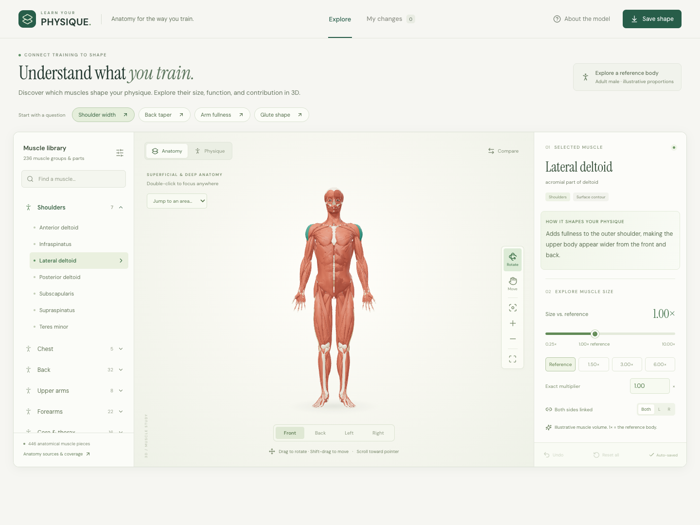

# Learn Your Physique

**Understand what you train.** An interactive 3D explorer that connects the muscles in your workout to the shape and function of your body.

[Open the explorer](https://atharva-create.github.io/learn-your-physique/) · [Watch the demo](launch/learn-your-physique-demo.mp4) · [Anatomy sources](public/anatomy/ATTRIBUTION.md)



## Why we built this

A training plan gives you a list of exercises. An anatomy chart gives you a list of muscles. There is often a missing connection between the two: **what does developing this muscle actually contribute to my physique?**

“Train shoulders” is broad advice. The outer, front and rear deltoids occupy different places and contribute to different contours. “Build your back” can mean exploring width beneath the armpits, thickness around the shoulder blades, or the slope between the neck and shoulders. An exercise name alone does not make those differences easy to picture.

Learn Your Physique grew out of that curiosity as a weekend side project built with Astra. We wanted to make anatomy something you could explore: select a muscle, see where it sits, read what it does, and change its size to understand its relationship to the rest of the body.

The goal is to help people who train bring more understanding and intention to their training. That might mean a beginner learning what a lateral raise involves, someone comparing the contributions of different parts of the arm, or a curious lifter exploring why a deep muscle can matter without creating a visible outline. You do not need to know the anatomical names before you start.

This project does not define an ideal body. It gives you a visual language for thinking about your own interests, noticing relationships between muscle groups, and asking better questions about the work you do in the gym.

## What you can learn

Different muscles contribute different kinds of shape. These are useful starting points for exploration, rather than guarantees about an individual's appearance:

| Question | Start with | What to look for |
| --- | --- | --- |
| What contributes to shoulder width? | Lateral deltoid | Fullness at the outer shoulder, viewed from the front and back |
| What contributes to back taper? | Latissimus dorsi | Width at the sides of the upper torso and beneath the armpits |
| What changes upper-chest fullness? | Clavicular part of pectoralis major | The contour beneath the collarbone |
| What shapes the upper arm? | Biceps, brachialis and triceps | Different contributions to the front, sides and back of the arm |
| What shapes the hips and glutes? | Gluteus maximus and gluteus medius | Rear projection and upper outer hip fullness |
| What creates different thigh contours? | Quadriceps, hamstrings and adductors | Front, outer, rear and inner thigh contributions |
| Why do calves have different layers? | Gastrocnemius and soleus | The upper calf and the deeper muscle underneath it |
| Does every important muscle change my silhouette? | Rotator cuff and other deep muscles | Movement and stability can matter even when a muscle is barely visible |

The app pairs major muscles with plain-language descriptions of their contribution, movement function and common exercise patterns. Smaller or less familiar structures receive broader context where detailed guidance is not yet available. An exercise often involves several muscles; listing it beside a muscle does not mean it isolates that muscle or a particular head.

Anatomical movement context draws on [OpenStax's Anatomy and Physiology 2e, chapter 11](https://openstax.org/books/anatomy-and-physiology-2e/pages/11-introduction). Visible physique also depends on the skeleton, muscle attachments, surrounding tissue and body composition. A stronger muscle is not necessarily a more visible muscle.

## A useful way to explore

1. **Begin with a question.** Use the shoulder width, back taper, arm fullness or glute shape prompts, browse a body region, search for a muscle, or select one directly on the model.
2. **Locate the muscle.** Read its contribution and function. Rotate around it; the front view rarely tells the whole story.
3. **Change one thing.** Move the size slider a little and watch the surrounding proportions. Start near the reference size before trying exaggerated values.
4. **Compare anatomy with silhouette.** Switch between **Anatomy** and **Physique**, then use **Compare** to place the reference beside your adjustments.
5. **Consider the whole body.** Explore adjacent muscles, deeper structures and different angles. Use what you notice as context for learning about training, rather than treating a slider setting as a workout target.

You can save an experiment, return to the reference, and try another direction. Exploring a shape does not commit you to pursuing it.

## What is included

- **236 muscle groups and parts**, represented by **446 muscle meshes**, across 12 regions from head to feet. Bilateral counterparts share controls and can be adjusted separately.
- A skeleton and skin surface to relate anatomical position to the outer silhouette.
- Size exploration from **0.25× to 10×**, logarithmic slider spacing, exact numeric entry and quick presets.
- Front, back and side views, free rotation, pointer-directed zoom, panning, regional focus and selected-muscle focus.
- See-through anatomy and isolation for inspecting structures beneath the surface.
- Side-by-side comparison, a list of adjustments, undo and reset.
- Local saving plus JSON export and import. No sign-up or backend.
- A responsive interface with touch controls and a muscle picker on smaller screens.

The coverage is broad, **but it is not every muscle in the human body**. Some segmental structures are grouped, some anatomical variants and small structures are absent, and some source meshes combine parts. Counts describe this dataset, not a definitive muscle count. Cardiac and smooth muscle are outside this explorer. Small eye, face and throat structures are included for anatomy study, not as suggested training targets.

## What the sliders mean

**1× is the reference muscle's geometric volume.** It does not mean one set, one unit of effort, a strength score, a percentage of your potential, or a predicted result after a certain amount of training.

The app enlarges each muscle across its two shorter dimensions while preserving its principal length. The skin surface responds approximately to nearby changes. The wide range makes relationships easy to see and lets you experiment with exaggerated proportions; the upper settings are not claims about achievable growth. At large settings, meshes may overlap and the skin approximation may look unnatural.

This is a generic adult male reference, not a model fitted to your measurements. It does not simulate tendon attachments, fascia, collisions, fat loss, changing posture or skeletal proportions. Enlarging a muscle in the app does not show exactly how your body would change. It also does not imply that training a region removes fat from that region.

Real outcomes reflect your starting point, anatomy, training, recovery, nutrition and time. Individuals can respond differently to resistance training, as illustrated by [Hubal et al.'s study of variation in muscle size and strength gains](https://pubmed.ncbi.nlm.nih.gov/15947721/). The product is an educational visualization, not a personalized training prescription or a validated hypertrophy forecast.

## Controls

| Action | Control |
| --- | --- |
| Rotate | Drag with **Rotate** selected |
| Pan up, down or sideways | Select **Move** and drag; or Shift-drag / right-drag |
| Zoom into a detail | Scroll with the pointer over it; or use + / − |
| Focus a point | Double-click the model |
| Jump to a region | Use **Jump to an area…** |
| Focus the current muscle | Use the focus icon |
| Restore the full view | Use **Fit whole body** |
| Use a touchscreen | One finger rotates or moves; two fingers pan and pinch |
| Use the keyboard | Tab between controls; arrow keys adjust the slider or pan a focused canvas |

## Run locally

Use Node.js 24 or later and npm.

```sh
git clone https://github.com/atharva-create/learn-your-physique.git
cd learn-your-physique
npm ci
npm run dev
```

Open the address printed by Vite, usually `http://localhost:5173`.

```sh
npm test                     # Data integrity, geometry and saved shapes
npm run build                # TypeScript check and production build
npm run preview              # Serve the production build
npx playwright install chromium
npm run test:browser         # Desktop, mobile and camera interactions
```

A WebGL-capable browser is required. Anatomical assets total approximately 45 MB, so the first load may take a moment. After loading, the model and controls run in the browser. Google Fonts supplies the interface typography; system fonts provide a fallback.

## GitHub Pages

The [deployment workflow](.github/workflows/deploy.yml) runs the unit checks, builds the static app, and deploys `dist` on pushes to `main`. The Pages publishing source is **GitHub Actions**. The build uses `VITE_BASE_PATH=/learn-your-physique/`, and all runtime assets respect that path.

To reproduce that build locally:

```sh
VITE_BASE_PATH=/learn-your-physique/ npm run build
VITE_BASE_PATH=/learn-your-physique/ npm run preview
```

Open `http://localhost:4173/learn-your-physique/`. When publishing a fork under another repository name, change the workflow's base path, canonical URL and social metadata in `index.html`. See [GitHub's custom Pages workflow documentation](https://docs.github.com/en/pages/getting-started-with-github-pages/using-custom-workflows-with-github-pages).

## Inside the project

React and TypeScript handle the explorer, Three.js renders the anatomical layers, and Vite builds the static site.

| Location | Responsibility |
| --- | --- |
| `src/App.tsx` | Selection, learning prompts, controls, comparison and saving |
| `src/model.ts` | Size transformations, validation and muscle explanations |
| `src/viewer.ts` | 3D layers, picking, camera navigation and surface deformation |
| `src/materials.ts` | Tissue appearance, procedural detail and rendering materials |
| `public/anatomy/` | Runtime models, grouping metadata and source attribution |
| `scripts/prepare_*.py` | Anatomy, skin and facial-data preprocessing |
| `tests/` | Geometry/data checks and browser interaction tests |
| `launch/` | Demo video, captions, launch post and recording notes |

Generated runtime assets are included, so Python is not needed to run or build the app. Rebuilding the assets requires Python, NumPy, SciPy and the upstream source files described in [the asset preparation notes](docs/ASSETS.md). The raw source archive and local development artifacts are intentionally excluded from Git.

Saved shapes stay in your browser's local storage until you reset them or clear browser data. **Save shape** exports a JSON file; **Import shape** restores it. The app does not add analytics or send shape adjustments to a server. Hosting and font providers still receive ordinary requests for the files they serve. The original `FORM` identifier remains inside version-1 shape files to preserve compatibility with earlier experiments.

## Sources and licensing

The interface, rendering code and simulation code are original and released under the [MIT license](LICENSE). Anatomical data and anatomy-derived imagery retain their own Creative Commons terms; they are not relicensed by the application license.

- **BodyParts3D**, © The Database Center for Life Science: reference anatomy, skeleton, skin and facial context.
- **Z-Anatomy**, by Gauthier Kervyn: supplemental muscle and connective-tissue anatomy.
- **Johan Bellander / BodyExplorer**: preparation and alignment of the combined muscle and skeleton GLBs.

See [full attribution, upstream links and license details](public/anatomy/ATTRIBUTION.md), including the retained CC BY-SA 2.1 Japan and CC BY-SA 4.0 notices and the current BodyParts3D CC BY 4.0 archive notice. No endorsement by these projects is implied.

## Where this could go

Useful next steps include more reference bodies, more precise surface behavior, better coverage of smaller muscles, clearer movement explanations, and accessibility and performance improvements. These are directions for future work, not existing features.

Contributions are welcome, especially anatomical corrections backed by a source, reproducible interaction bugs, and explanations that make training anatomy easier to understand. When reporting a visual issue, include the muscle, size setting, layer, viewing angle, browser and device. Please preserve asset attribution in derivatives.

Built by [Atharva](https://github.com/atharva-create), with Astra, over a weekend of curiosity about training and the human body.
